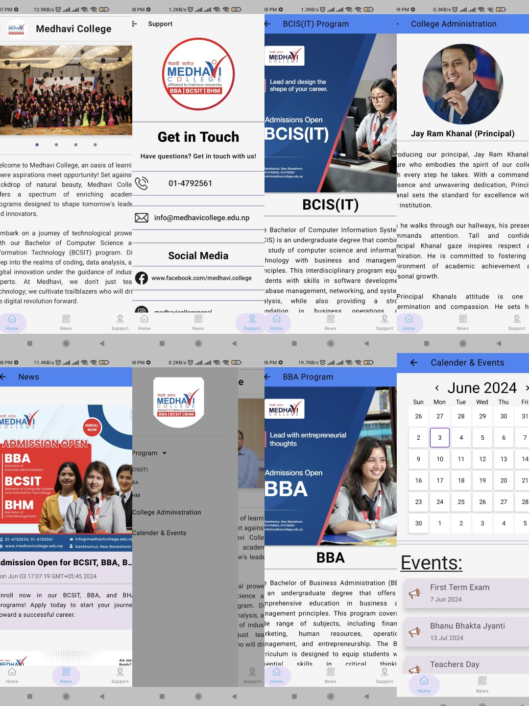

# CollegeApp

Welcome to the CollegeApp repository! This project is an Android application developed to help college students manage their academic activities and resources effectively. The app is built using modern Android development tools and frameworks including Jetpack Compose, Hilt, Jetpack Navigation, and the MVVM architecture.



## Table of Contents

- [Features](#features)
- [Technologies Used](#technologies-used)
- [Getting Started](#getting-started)
- [Installation](#installation)
- [Usage](#usage)
- [Contributing](#contributing)
- [License](#license)

## Features

- **News Section**: Easily view the college news and updates.
- **Calender and events**: View your  upcoming events.
- **Support section**: For any  help and inquery there is support section .
- **programs**: view the different programs available by college.

## Technologies Used

- **Jetpack Compose**: For building the user interface declaratively.
- **Hilt**: For dependency injection.
- **Jetpack Navigation**: For handling navigation within the app.
- **MVVM (Model-View-ViewModel)**: For structuring the application and separating concerns.

## Getting Started

To get a local copy up and running, follow these simple steps.

### Prerequisites

- Android Studio Bumblebee (or higher)
- JDK 11 (or higher)
- An Android device or emulator running Android 5.0 (Lollipop) or higher

### Installation

1. **Clone the repository**:
   ```sh
   git clone https://github.com/sarmesh17/MedhaviCollege
